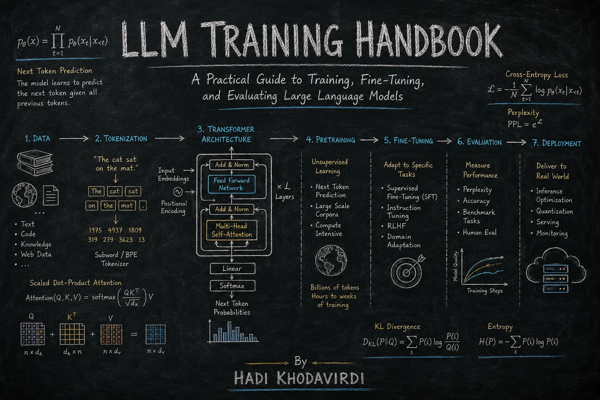

<div align="center">

# LLM Training Handbook

### A Practical Guide to Training, Fine-Tuning, and Evaluating Large Language Models

**From data and tokenization to Transformer architecture, pretraining, scaling, post-training, evaluation, systems, and inference.**

<p>
  <strong>📘 Engineering-focused</strong>
  &nbsp;·&nbsp;
  <strong>🌍 English + فارسی</strong>
  &nbsp;·&nbsp;
  <strong>🧠 LLM Engineering</strong>
  &nbsp;·&nbsp;
  <strong>🛠️ Practical & Technical</strong>
</p>

</div>

<p align="center">
  
</p>

---

## 📖 About the Book

**LLM Training Handbook** is a practical, engineering-oriented guide to understanding how modern **Large Language Models (LLMs)** are built, trained, adapted, evaluated, optimized, and deployed.

The handbook is deliberately organized around the **full lifecycle of an LLM system**, rather than treating each topic as an isolated concept:

```text
Problem
   ↓
Data
   ↓
Tokenization
   ↓
Transformer Architecture
   ↓
Pretraining
   ↓
Scaling
   ↓
Post-Training
   ↓
Evaluation
   ↓
Training & Serving Systems
   ↓
Inference & Decoding
   ↓
Production
```

The goal is not simply to explain *what* an LLM component is. The goal is to help the reader understand **why it exists, how it works, what trade-offs it introduces, how it fails, and how an engineer should reason about it in a real system**.

The handbook's core perspective is simple:

> **LLMs are not only models. They are engineered systems.**

A production LLM can involve data pipelines, tokenizers, model architecture, training infrastructure, post-training, retrieval, decoding, inference servers, caching, evaluation, monitoring, and product integration. Understanding how these layers interact is essential for building reliable LLM systems.

---

## 🌍 Two-Language Edition

This project is maintained as a **bilingual technical handbook**:

| Language | Audience | Status |
|:---|:---|:---|
| **English** | International AI/ML engineering audience | Available |
|  **فارسی (Persian)** | Persian-speaking AI/ML engineering audience | Available |

The Persian edition is not intended to replace technical terminology with informal translations. Established terms such as **Transformer, Tokenization, Pretraining, Post-training, Scaling Laws, Inference, Evaluation, Fine-tuning, Quantization, RAG, and LLM** are retained where that is clearer for an expert technical audience.

This keeps the Persian edition aligned with the terminology used in papers, frameworks, documentation, and engineering teams.

> **Recommended approach:** read either language independently, while using the bilingual terminology to build a consistent technical vocabulary across English and Persian resources.

---

## 🎯 Who Is This Handbook For?

This handbook is designed for readers who want to move beyond high-level LLM explanations and understand the **engineering stack underneath modern language models**.

It is especially useful for:

- **Machine Learning Engineers**
- **Deep Learning Engineers**
- **AI Engineers**
- **LLM / Generative AI Engineers**
- **AI Researchers**
- **Data Scientists moving into LLMs**
- **Software Engineers building LLM applications**
- **Technical Leads evaluating LLM systems**
- **Advanced students with foundational ML knowledge**

The material assumes familiarity with fundamental Machine Learning concepts such as:

- training and validation
- loss functions
- gradient descent
- neural networks
- embeddings
- probability distributions
- overfitting
- evaluation metrics

Prior Transformer experience is helpful, but the relevant architecture is introduced explicitly in the handbook.

---

## 🧭 What You Will Learn

The handbook follows the progression from **foundations → model training → post-training → evaluation → systems → inference**.

### Part I — Foundations

| Chapter | Topic | Engineering Focus |
|:---:|---|---|
| 00 | **Preface** | How to use the handbook and how to reason about LLM systems |
| 01 | **Introduction** | Language modeling, scaling, and the foundations of LLMs |
| 02 | **Data** | Data collection, filtering, deduplication, contamination, and data quality |
| 03 | **Tokenization** | BPE, WordPiece, SentencePiece, multilingual and Persian tokenization |
| 04 | **Transformer Architecture** | Attention, positional representations, decoder-only Transformers, compute and memory |

### Part II — Training

| Chapter | Topic | Engineering Focus |
|:---:|---|---|
| 05 | **Pretraining** | Next-token prediction, loss, optimization, training stability, checkpointing |
| 06 | **Scaling Laws** | Compute/data/parameter scaling and compute-optimal training |
| 07 | **Post-Training** | SFT, instruction tuning, RLHF, DPO, reward modeling, alignment |

### Part III — Evaluation & Systems

| Chapter | Topic | Engineering Focus |
|:---:|---|---|
| 08 | **Evaluation** | Benchmarks, human evaluation, LLM-as-a-Judge, RAG evaluation, evaluation bias |
| 09 | **Systems** | GPU fundamentals, parallelism, MFU, low precision, FlashAttention, ZeRO/FSDP |
| 10 | **Inference & Decoding** | Autoregressive decoding, sampling, KV cache, batching, quantization |
| 11 | **Outlook** | MoE, state-space models, multimodality, agents, long context, future directions |
| 12 | **Glossary** | Terminology, notation, and common acronyms |

The chapter structure follows the handbook's stated progression from foundations through deployment and terminology.

---

## 🛠️ The Engineering Mindset

A recurring theme throughout the book is that LLM quality cannot be explained by parameter count alone.

A practical engineer asks:

> **Which layer is failing, and what evidence shows that?**

For example:

| Observed Problem | Areas to Investigate |
|---|---|
| Factual errors | Data · Retrieval · Evaluation · Decoding |
| Poor formatting | Post-training · Templates · Prompts |
| High latency | Inference · Batching · KV Cache · Quantization |
| Weak domain knowledge | Data · RAG · Fine-tuning |
| Poor multilingual behavior | Data mixture · Tokenizer · Evaluation |
| Unstable answers | Decoding · Evaluation · Post-training |
| High serving cost | Model size · Routing · Caching · Compression |

This leads to a practical iteration loop:

```text
Build a baseline
      ↓
Measure
      ↓
Identify failure modes
      ↓
Change one component
      ↓
Evaluate again
      ↓
Deploy carefully
      ↓
Monitor real behavior
      ↺
```

The objective is not to memorize techniques. It is to develop the ability to **diagnose systems, reason about trade-offs, and choose interventions based on evidence**.

---

## 🗺️ Recommended Reading Paths

### 🛠️ LLM / Systems Engineer

Start with:

```text
01 → 04 → 05 → 07 → 08 → 09 → 10
```

Focus on architecture, training, post-training, evaluation, infrastructure, and inference.

### 🔬 AI / ML Researcher

Start with:

```text
01 → 02 → 03 → 04 → 05 → 06 → 07 → 08
```

Focus on modeling foundations, data, architecture, optimization, scaling, and evaluation.

### 📊 Data / ML Engineer

Start with:

```text
01 → 02 → 03 → 05 → 08
```

Focus on data quality, representation, tokenization, training, and evaluation.

### 🤖 LLM Application Engineer

Start with:

```text
01 → 07 → 08 → 10 → 11
```

Focus on post-training, evaluation, inference, tool use, and emerging LLM systems.

### 📚 Reference Use

If you already have LLM experience, the handbook can also be used non-linearly. Jump directly to the chapter corresponding to the engineering problem you are investigating.

---

## 📁 Repository Structure

The repository is organized so that the Markdown content can also serve as the source for a **Docusaurus documentation site**.

A typical structure is:

```text
.
├── README.md
├── assets/
│   └── llm-training-handbook-cover.png
│
├── docs/
│   ├── 00-preface.md
│   ├── 01-introduction.md
│   ├── 02-data.md
│   ├── 03-tokenization.md
│   ├── 04-transformer-architecture.md
│   ├── 05-pretraining.md
│   ├── 06-scaling-laws.md
│   ├── 07-post-training.md
│   ├── 08-evaluation.md
│   ├── 09-systems.md
│   ├── 10-inference-and-decoding.md
│   ├── 11-outlook.md
│   └── glossary.md
│
└── ...
```

> The exact repository layout may evolve as the Docusaurus site develops. The chapter links in the handbook are intentionally kept as relative Markdown links so the content remains portable.

---

## 🌐 Documentation

The project has two complementary surfaces: the **GitHub repository** for source, collaboration, and version history, and the **Docusaurus site** for reading the handbook as structured documentation.

The repository is designed to support a Docusaurus documentation experience in addition to GitHub Markdown.
---
## 📖 Read the Handbook

The complete handbook is available as a Docusaurus website:

🌐 Website:
`https://hadikhd.github.io/llm-training-handbook/`

Source Markdown files:

### English 🇬🇧

- [Preface](./docs/00-preface.md)
- [Introduction](./docs/01-introduction.md)
- [Book Index](./docs/index.md)

### فارسی 🇮🇷

If the Persian edition is stored alongside the English edition, use the corresponding Persian Markdown/Docusaurus documents from the repository's language-specific documentation structure.

> **Note:** The exact Persian file paths may depend on the Docusaurus i18n configuration. Keep the language-specific paths consistent with the project's `i18n` configuration.

- [پیشگفتار](./i18n/fa/docusaurus-plugin-content-docs/current/00-preface.md)
- [مقدمه](./i18n/fa/docusaurus-plugin-content-docs/current/01-introduction.md)

## 🧩 Why This Handbook Exists

The LLM field moves quickly.

New models, training recipes, benchmarks, inference engines, alignment methods, and agent frameworks appear continuously. A handbook that simply catalogs current techniques becomes outdated quickly.

This book therefore emphasizes **durable engineering concepts**:

- Why does data quality affect model behavior?
- Why does tokenization matter?
- Why does the Transformer architecture scale?
- Why is next-token prediction such a powerful training objective?
- How do compute, data, and parameters interact?
- What does post-training actually change?
- Why is evaluation itself an engineering system?
- Where do training and inference systems become bottlenecks?
- How do decoding choices change behavior?
- What evidence should guide an engineering decision?

The intention is to build a mental model that remains useful even as specific models and frameworks change.

---

## 📐 Technical Depth

This is an **engineering-first** handbook, not a purely mathematical treatment.

Mathematics is introduced when it clarifies an engineering mechanism, including topics such as:

- probability distributions
- cross-entropy loss
- embeddings
- attention
- softmax
- optimization
- scaling relationships
- memory and compute complexity

The guiding question is always:

> **What does this equation help an engineer understand, measure, predict, or optimize?**

---

## 🔭 Future Direction

The handbook is designed to evolve with the LLM ecosystem.

Future revisions may expand topics such as:

- Multimodal models
- Agentic systems
- Long-context training
- Retrieval-Augmented Generation (RAG)
- Alignment and preference optimization
- Efficient serving
- Advanced inference optimization
- Mixture-of-Experts (MoE)
- State Space Models (SSMs)
- Tool use and agent systems

The goal is to preserve the engineering foundations while extending the handbook as the technology matures.

---

## 🚀 Docusaurus Documentation Site

This handbook is also published as a documentation website built with [Docusaurus](https://docusaurus.io/), a modern static website generator.

The Markdown chapters are the source content, while Docusaurus provides the documentation navigation, local development environment, static build, and deployment workflow.

### Installation

Install the project dependencies:

```bash
npm install
```

> **Note:** Feel free to use the package manager of your choice, such as `npm`, `yarn`, `pnpm`, or `bun`, as long as the project's lockfile and scripts are respected.

### Local Development

Start the local Docusaurus development server:

```bash
npm run start
```

This starts a local development server and opens the documentation site in a browser. Most content and configuration changes are reflected live without requiring a manual restart.

### Build

Generate the production-ready static website:

```bash
npm run build
```

The generated static content is written to the `build/` directory and can be served by a static hosting provider.

### Deployment

#### Deploy with SSH

```bash
USE_SSH=true npm run deploy
```

#### Deploy without SSH

Replace `<Your GitHub username>` with your GitHub username:

```bash
GIT_USER=<Your GitHub username> npm run deploy
```

If the project is hosted with **GitHub Pages**, the Docusaurus deployment command provides a convenient workflow for building the website and publishing the generated site to the `gh-pages` branch.

### Typical Development Workflow

```text
Edit Markdown
     ↓
Run the local Docusaurus server
     ↓
Review the documentation in your browser
     ↓
Fix Markdown / LaTeX / links / navigation
     ↓
Run the production build
     ↓
Deploy to GitHub Pages
```

> **Documentation principle:** The Markdown files should remain readable and portable on their own, while Docusaurus provides the full documentation-site experience.

## 🤝 Contributing

Contributions are welcome, especially contributions that improve:

- technical correctness
- mathematical clarity
- engineering examples
- Persian technical terminology
- English/Persian terminology consistency
- Docusaurus compatibility
- broken links
- diagrams and documentation quality

When proposing a technical change, please prefer **evidence, reproducible examples, and clear engineering reasoning** over purely stylistic changes.

---

## 📝 Documentation Principles

This project aims to keep the handbook:

- **Technically rigorous**
- **Engineering-oriented**
- **Practical**
- **Readable**
- **Bilingual**
- **Docusaurus-compatible**
- **Maintainable**
- **Explicit about trade-offs and limitations**

The README is intentionally concise enough to function as the repository's entry point. Detailed explanations belong in the individual chapters and documentation site.

---

## 📌 Project Status

**Active technical handbook / evolving documentation project**

The content is being developed iteratively. Chapters may be revised as technical terminology, engineering practices, and the broader LLM ecosystem evolve.

---

## 🔗 Project

**Repository:**  
https://github.com/hadik/llm-training-handbook

---

<div align="center">

### LLM Training Handbook

**Learn the model. Understand the system. Engineer the whole stack.**

🇬🇧 English &nbsp;·&nbsp; 🇮🇷 فارسی &nbsp;·&nbsp; 🧠 LLM Engineering

</div>
